Today will be one of the more exciting days as I'm prepared to head for the airport via hitchhiking.

Achievement unlocked: I woke up at 6.30 am today.

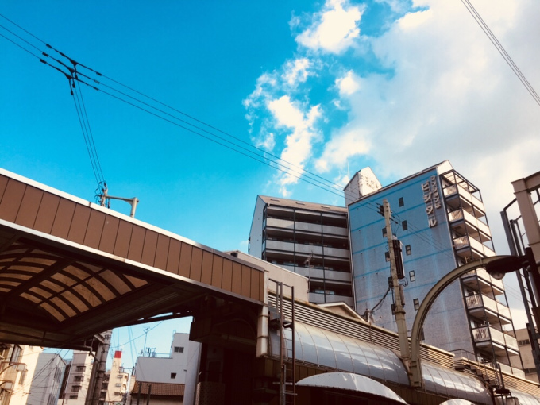

Due to my strong desire to hike that day, I headed for the mountains rather than the airport.

I want to climb Mt Kongo!

I took a 500 yen train ride and 520 yen bus ride to my destination.

My sensible self committed suicide. I was left with approximately 1050 yen. I still had 24 more hours to survive in Japan.

I was totally prepared to beg for onigiris from fellow trekkers. I prayed that the kitsune udon and two eggs in the morning could at least sustain me until dinner.

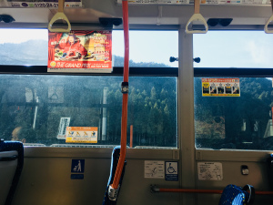
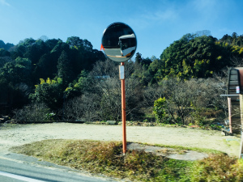
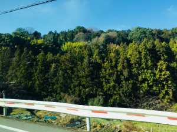
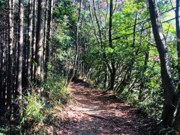

I dropped off the bus and began my hike!

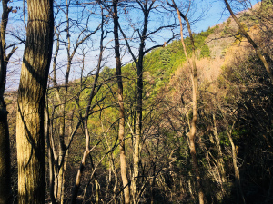

The beautiful thing about hiking in Japan is that oncoming hikers going downhill will greet you 'Konichiwa' when you pass by them.

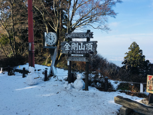

After an hour and a half climb, I reached the summit.

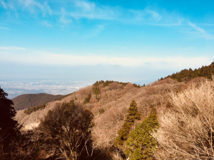
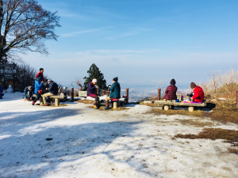

I was famished. I really wanted to ask one of the people camping up there for food, but I didn't dare to.

After walking around in circles on the mountain top, immensely jealous of the spread of food people were enjoying, I decided to go for it.

I asked my friends on WhatsApp  to translate for me 'I am hungry, can you please spare me some food'.

I copied the translation into the Google voiceover app, and mustered every bit of courage I had to approach the friendliest looking group.

"Boku wa ima chou harahetta, sukoshi tabemono wo kuremasu ka?" The phone said.

The group of ladies looked at me confused. I guess the phone speaker was a tad bit too soft.

"I am hungry." I said.

"Welcome! Join us!" One of the ladies said.

"Help yourself!" She said, while giving me a bowl and a spork.

Elated, I thanked the ladies profusely and dug in.

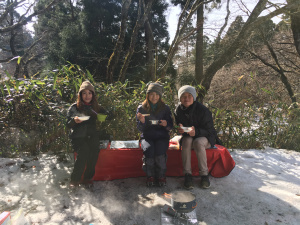

It was the best meal I had in Japan period.

I had a full 3-course meal consisting of a Nabe hotpot, a strawberry Swiss roll, multiple bowls of drip coffee (they didn't bring extra cups haha) and a slice of sweet potato.

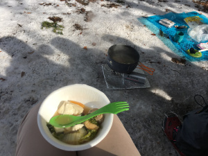

One of the ladies' birthday is on 29th December which is just a day away from my birthday (30th December). She loves to eat sweet potato, so they bought her a sweet potato with a 'Happy Birthday' candy on top. How cute!

They celebrated her birthday and mine too!

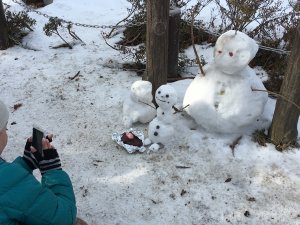

The sweet potato was so creamy and sweet(that is obvious I know), I fully understood why the lady loved sweet potato so much that her friends made it her birthday cake.

Despite our troubles communicating clearly with each other, I felt their sincerity and genuineness from the bottom of my heart.

Perhaps, the best seasoning to a meal is love and selflessness. The most delicious food doesn't always come from Michelin starred restaurants.

It is food that is shared with big and open hearts that will be blissfully etched in our memories forever.

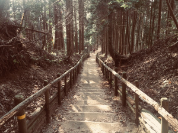

After filling myself up and bidding farewell to my newly-made friends, I skipped and jumped my way down the mountain.

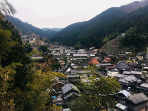

Soon, I began my long walk back to the train station where I took my bus.

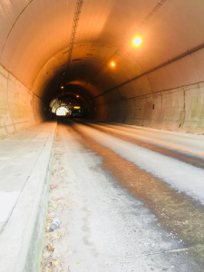

Along the way, I stuck out my thumb at the passing vehicles, trying my luck on hitchhiking.

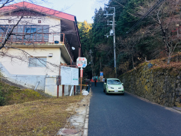

Luckily enough, after about the twentieth vehicle, a car finally stopped.

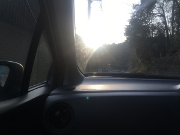

Driving the car was a friendly old man. He said a lot to me. But since I didn't understand a single word he said, I replied 'Un' and nodded my head every time he spoke.

It was a long ride. Half an hour later, we finally reached Kawachi-Nagano station, where he dropped me off

At the bus stop, I calculated the fare to the airport.

According to Google Maps, I needed 1650 yen to get to the airport by train. Tragically, I only had 1050 yen in my pocket.

Distance to airport: 30km. I had more than 12 hours before my flight.

Alright.

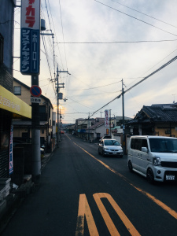

I began my route march towards the airport. Along the way, I flashed out my hitchhiker's thumb to the oncoming drivers.

No luck.

It seemed that getting a hitch on the narrow town roads was next to impossible.

While walking, I saw an expressway along the route to the airport on my Google Maps.

Guessing that I would get better luck at the expressway, I made my way there.

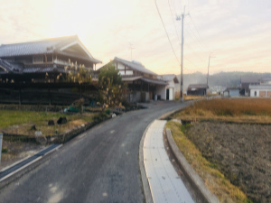
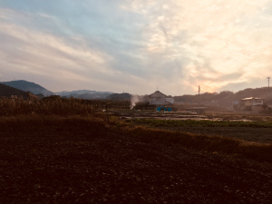

As the sun began to set, I finally reached the expressway.

I flashed out my thumb again, standing hopefully in the cold. Dozens of drivers drove past me. Most of them just ignored me, while some gave me a curious smile.

After standing there for 20 minutes or so, I thought my chances were slim.

Maybe the cars don't usually stop in the middle of the road. I probably should continue walking for a better hitchhiking spot.

Far ahead of me, there was a petrol kiosk with a convenience store beside. There were plenty of vehicles parked there.

Hopeful, I headed over.

I walked to a car parked at the convenience store and showed the driver my note.

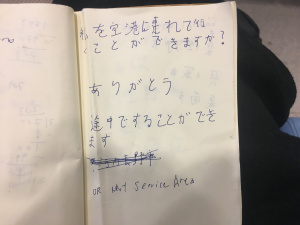

No. He shook his head.

I approached the next driver. The same response was given.

At that time, the sky had already turned dark. The temperature had also fallen sharply.

I was starting to feel devastated and was beginning to doubt the soundness of my decision to hitchhike.

"Worse come to worst, I will just walk the 30km." I thought to myself.

I then walked to the nearby petrol kiosk and approached a vehicle waiting for its turn to refuel.

The driver turned down his windows.

"Sumimasen. Kansai Airport?"

"No. Not going there."

"Nearby or on-the-way please? " I showed him my note.

He took a look and asked me to get in.

I was ecstatic.

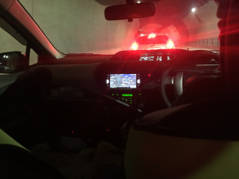

The driver turned out to be a 76 year old man. His name was Tera-san. He had a cute little dog on the front seat. He spoke good English!

We had a nice conversation along the way.

I soon realised that he was actually going out of his way to drive me to the train station near the airport as his house was actually nearby the petrol kiosk!

He had also given up refuelling his petrol to drive me to my destination.

I was immensely touched by his kindness.

"Are you hungry?"

"Yes a little bit... Actually I am very hungry!"

"Let's go for dinner!"

Tera-san drove me to a restaurant.

It was a self-serve restaurant where we had to pick and choose our dishes. I chose the spicy chicken with bean sprouts and a fried beef cake after seeing the relatively affordable price tag.

Just when I was about to pay for my food, Tera-san took out his 1000 yen note and said that it was his treat.

Surprised, I tried to refuse his offer. He was however insistent on paying. I gladly accepted his generosity in the end.

I wolfed down my meal, licking the plate clean.

While eating, I learnt about Tera-san's family. He had a wife, 2 daughters, 1 son and 5 grand-children.

"If you are visiting Japan the next time, feel free to find me!"

"Sure, definitely!"

He then scribbled down his email address on the restaurant's disposable menu.

At that point in time, I was grateful beyond words.

This kind man went out of his way to drive me towards the airport, gave up refuelling his petrol, brought me to a restaurant and offered to host me when all I did was ask for a ride.

I was absolutely inspired by his heart of gold.

After the wonderful meal, he drove me to the train station. Along the way, he gave me precise information on where to buy the train tickets and where to change trains.

Before leaving, he said "Today is a Christmas present from me."

I thanked him sincerely and waved goodbye.

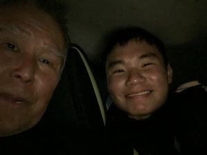

Life is all about giving and receiving.

