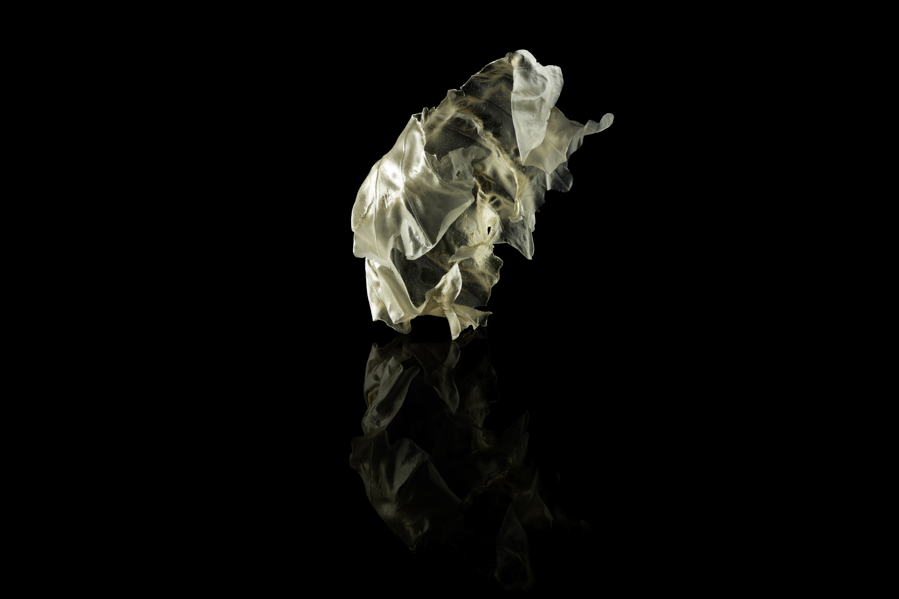
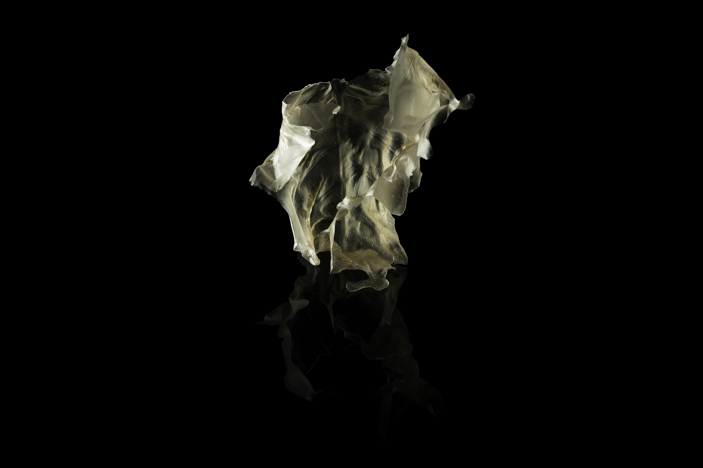
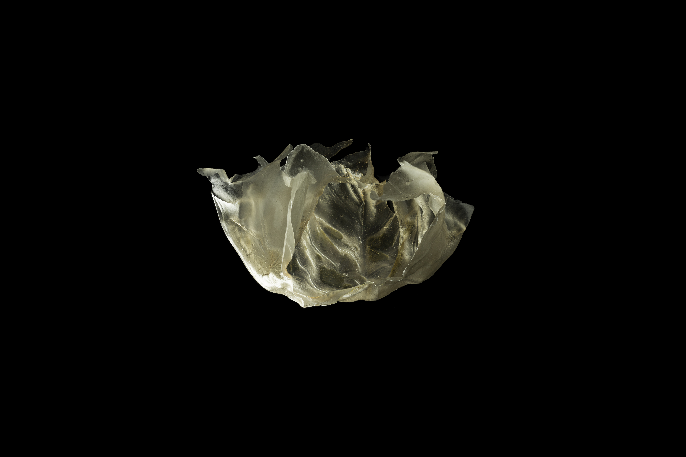

In this project, I spent 6 weeks under the tutelage of [Hans Tan](https://hanstan.net) to make a fascinating piece of flour.

This project transformed my way of thinking. The world isn't a linear sequence of 1s and 0s.

While we can specify instructions and pass it on to nature, nature jumbles them up and throw us a crumpled paper ball of mess.

Making is a process of exploration. We throw in the ingredients and wait for the unpredictable steam to create the product.

Rationalization only comes after, as we untangle the information wire and synthesize new conclusions.

[Read more about my journey here →](/modules/id1105-making-the-fascinating-kueh)