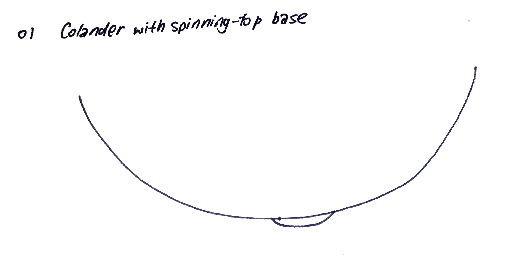
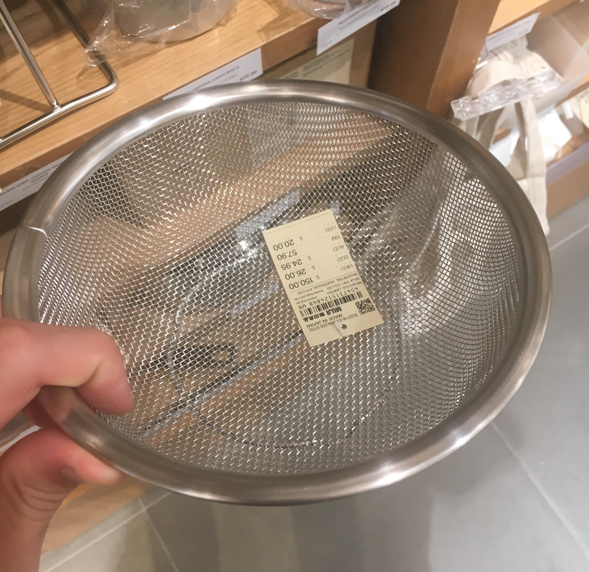
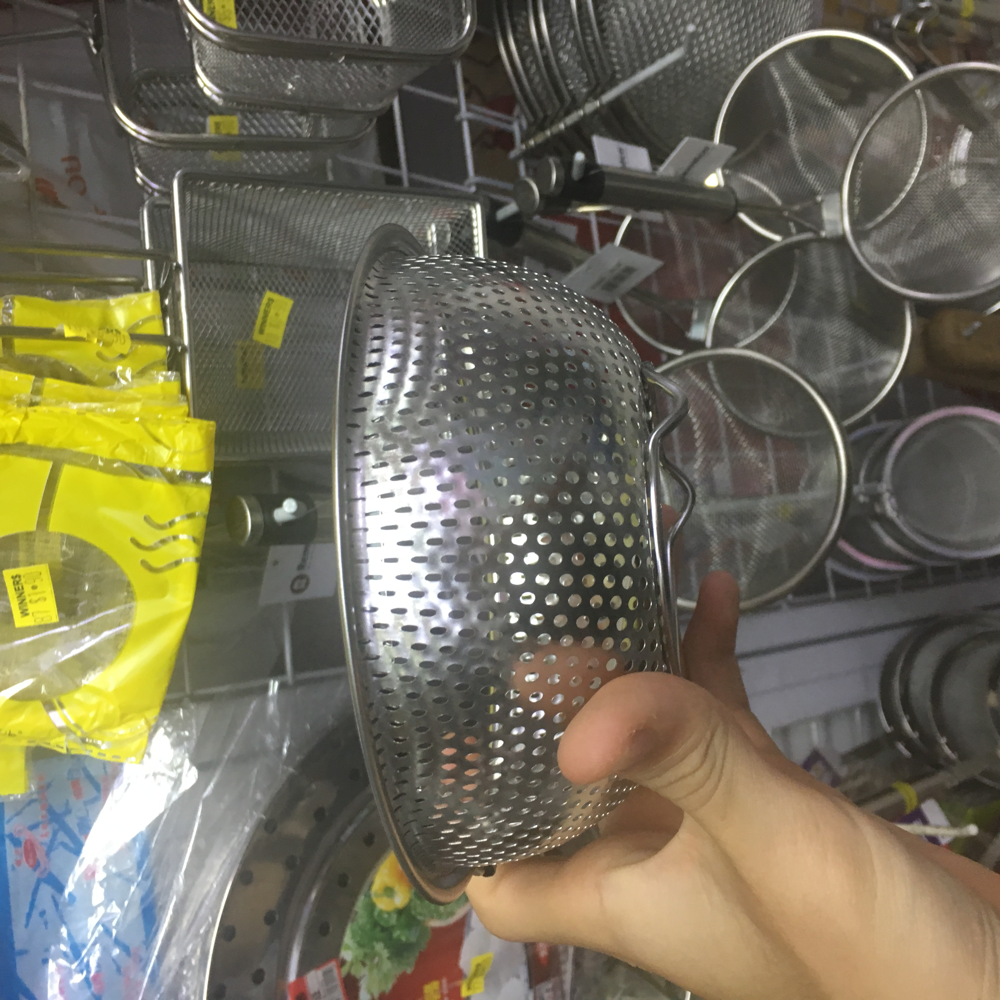
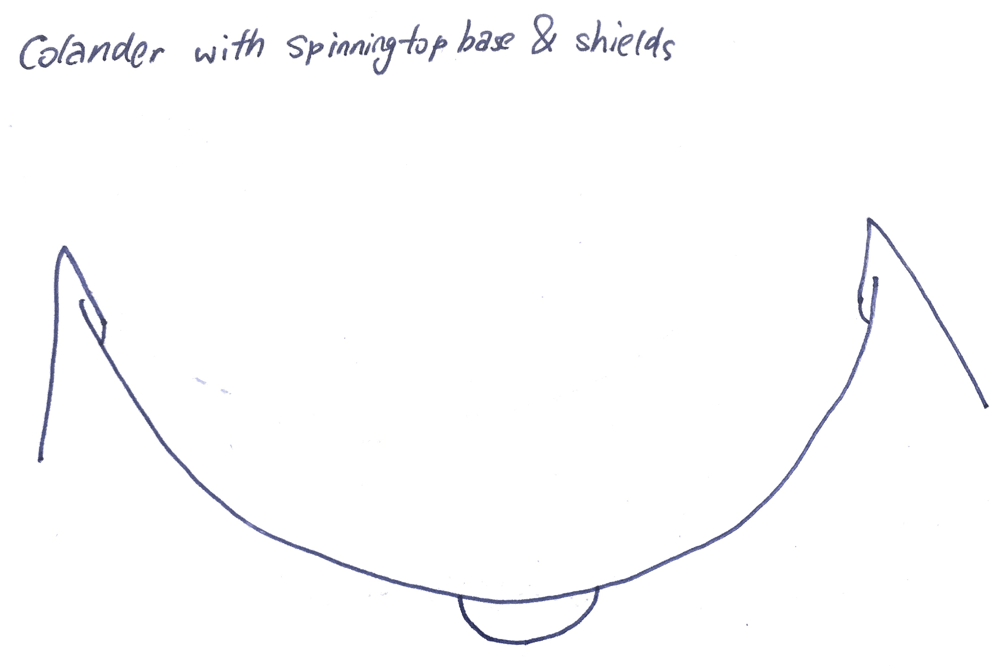
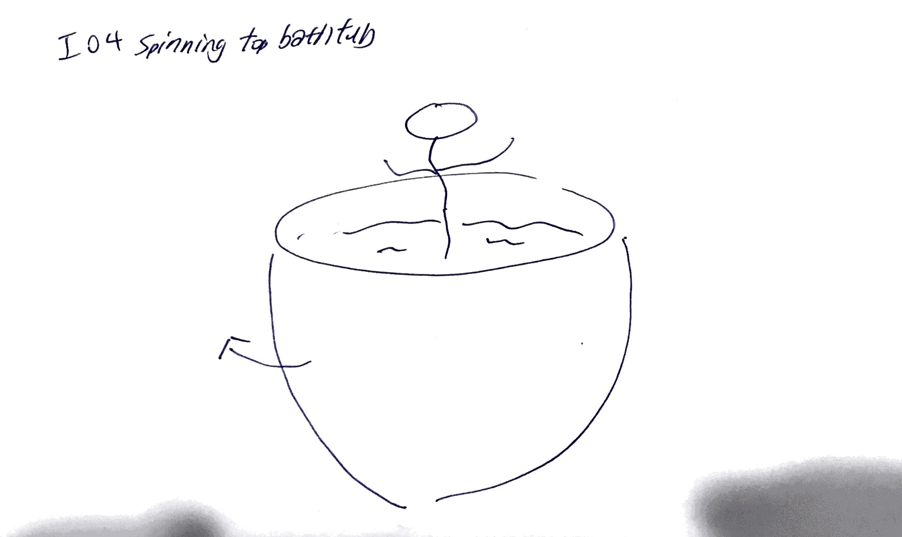
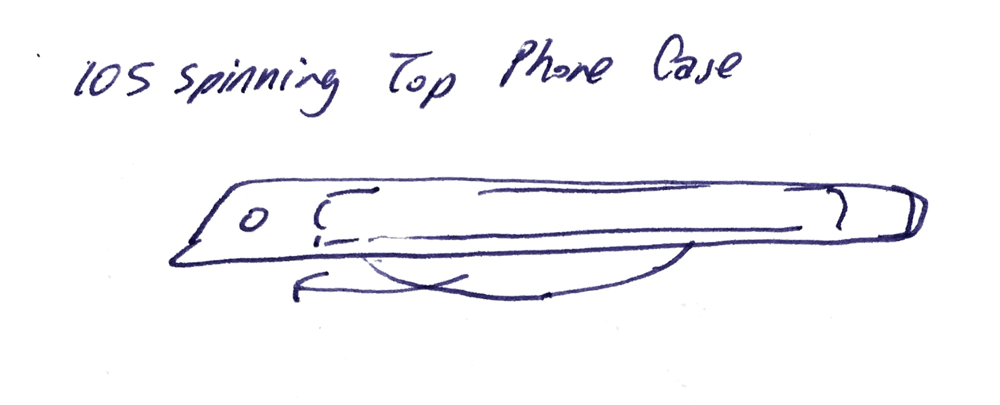
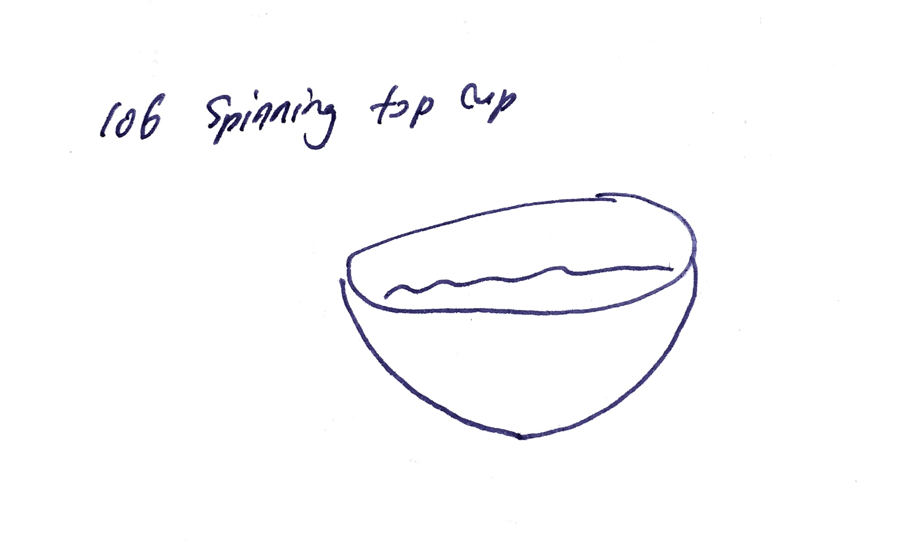
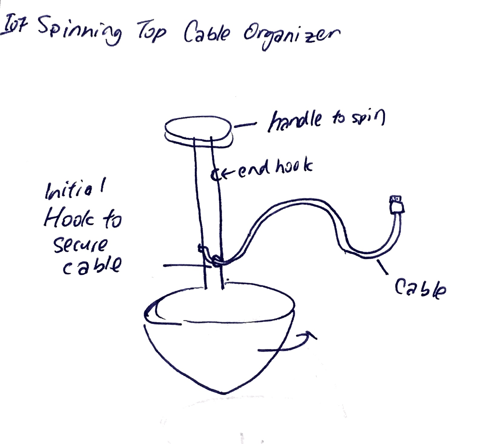

**Table Of Contents:**

- [Introduction](#introduction)
  - [Task Requirement:](#task-requirement)
- [About the man](#about-the-man)
- [Abbrevations:](#abbrevations)
- [The Spinning Top](#the-spinning-top)
  - [Diagnosis](#diagnosis)
  - [My Spinning Top Ideas](#my-spinning-top-ideas)
    - [I01 Colander with Spinnning Top Base](#i01-colander-with-spinnning-top-base)
    - [I02 Colander With Spinning Top Base & Shields](#i02-colander-with-spinning-top-base--shields)
    - [I03 Spinning Top Dice](#i03-spinning-top-dice)
    - [I04 Spinning Top Bathtub](#i04-spinning-top-bathtub)
    - [I05 Spinning Top Phone Case](#i05-spinning-top-phone-case)
    - [I06 Spinning Top Cup](#i06-spinning-top-cup)
    - [I07 Spininng Top Cable Holder](#i07-spininng-top-cable-holder)
- [Assignments](#assignments)
  - [A01](#a01)
- [Footnotes](#footnotes)

## Introduction

In this assignment, we have to design and fabricate a spinning top belonging to a designer we have been assigned to. My designer is [this Italian guy who has passed away](https://en.wikipedia.org/wiki/Achille_Castiglioni).

### Task Requirement:

- Demonstrate how your spinning top belongs in the designer's body of work
- Pitch Day
  - 3-slide A4 Summary Presentation
  - Deadline: 9 Sept 2019
- Exhibition Day
  - Appearance Model and print-outs of 3-page summary slides
  - Peer Evaluation Session
  - Date: 17 Sept 2019
- Appearance Model
  - Scale: 1:1
  - Encouraged to use materials and processes indicative of the designer and era
  - May purchase existing spinning top from market

## About the man


[Image Source 🚰](https://en.wikipedia.org/wiki/File:Portrait_of_Achille_Castiglioni_(1918%E2%80%932002),_cropped.jpg)

```
Name: Achille Castiglioni

Country: Italy 🇮🇹

Born: 16 February 1918

Died: 2 December 2002 (aged 84)

Studio: Castiglioni Studio (Was actually co-founded by Pier & Livio Giacomo)
```

## Abbrevations:

- **I:** Idea
- **A:** Assignment

## The Spinning Top

### Diagnosis

- Mr Castiglioni is very focused on making things functional 🔨

"...I cannot but wish that education and culture will lead users to reject prestige pieces, and the industry to manufacture increasingly genuine and less expensive objects, without using designers' names to raise the prices. Let designers names disappear but their works be used, if valuable to create products of real industrial design-nones that can be labelled neither Italian nor Euopean. So: not Italian success, but the success of a valuable design method."[^1]

"There is no Castiglioni style. There is a Castiglioni method. What matters is only the function of objects, their use."[^2]

- I heaved a sigh of relief when I read the above quotes. I personally despise overpriced "useless" items wasting our Earth's precious resources.
- It is such an irony though that his lamp is now being sold for [impossibly high prices](https://www.finnishdesignshop.com/lighting-floor-lamps-arco-floor-lamp-p-17805.html?region=sg&gclid=Cj0KCQjwy97qBRDoARIsAITONTI-QSJyglpxeYlg2pqP0MG9mxbyg6BG1jO19fCJl692m6F3VuniXyQaAvA0EALw_wcB).

### My Spinning Top Ideas

#### I01 Colander with Spinnning Top Base







**Why Colander?**

- The colander is a pretty well-established design archetype
  - It is easier to make something useful when you already have something useful to build upon
- The colander does have a flaw:
  - It take ages sometimes to strain out all the water ⏳

**How would it work?**

- The spinning top colander will work like a tumbler dryer 💦
- Spinning the colander will dry the items inside quicker ⚡️

**Why Spinning Top Colander?**

- Drying stuff in a colander is pretty boring
- There is nothing much one can do to accelerate the process, making it very frustrating 😣
- It would be fun to have something to play with while saving time in the process

#### I02 Colander With Spinning Top Base & Shields



**Shields?**

- While I was happily sharing my idea with my friend, he pointed out that the water will spray out when one spins the colander
- The most obvious solution is to add shields at the sides
- Thankfully, the items will stick to the upper half of the colander when one spins it (like a tumbler dryer)
- Hence, the shields will only be needed on the upper half of the colander

**Might they actually be needed?**

- Adding shields will increase the cost of making the colander
- As a frugal person, I am not really enthusiastic about the idea of spending too much money on a project that has low probability of generating profits
- The user may choose to spin the *colander without a shield* in the sink instead
- In that case, the water won't be sprayed onto his/her clothing 👚

**Thoughts 🤔**

- It is impossible for me to know whether the colander idea works until I try it out
- Over the next few weeks, I will try to get a colander and solder a spinning top at the bottom of it
- Then, I will try drying my breakfast [instant noodles](https://kokanoodles.com/product/koka-purple-wheat-chilli-lime-noodles/) with it

#### I03 Spinning Top Dice


- Throwing dice gives you the results in a second
- But spinning a spinning top dice takes forever for you to get a result
- It would be heart-wringing to wait for the dice to stop
- After some googling, I realise this idea is already [in production](https://www.thegreenhead.com/2017/11/spinning-dice-top.php) 😀

#### I04 Spinning Top Bathtub



- This is a whacky idea 😜
- I thought it would be fun to have a spinning bathtub which will theoretically be like a jacuzzi 🛁
- Not sure how it really relates to Mr Castiglioni 😅

#### I05 Spinning Top Phone Case



- Inspiration for this idea comes from observing people spinning their phones when they are bored
- It would be cool if the phone will automatically launch an app when its gyroscope detects spinning
- Phone will then start displaying balls going up and down based on the tilt angle of the phone

#### I06 Spinning Top Cup



- It is sometimes impossibly difficult to find a stirrer in the morning to stir my coffee ☕️
- I would usually have to resort to shaking the coffee mug to get an even mixture, which isn't very effective
- If the cup can spin, the stirrer would no longer be needed
- & I can enjoy my cup of morning gold without always having to search for a stirrer 😀

**Forseeable problems**

- Spillage of liquid
  - It should be self-balancing
  - Maximum tilt angle of the cup should be limited

#### I07 Spininng Top Cable Holder



- It sucks to have a tangled cable 🤯
- [Existing cable organisers](https://www.zulily.com/p_/-39143586.html?rtn=y&page=pdp&tid=googplaSG_1133_2031020841_74563369631_39143587_zcvp2_SG&cc=SG%7CSGD&gclid=CjwKCAjwtO7qBRBQEiwAl5WC22Ur12DaiS37oV2DLUzDxeXOAj37V9bvCweAjwYEyPb1dBDrgpQmQRoCIOUQAvD_BwE) are a pain to use 😳
  - They mostly require you to twirl the cable around the cable holder which can be really tedious
- With a spinning top, you can make use of the spinning motion to keep you cables tidy 🤩

## Assignments

### A01

**List 3 reference books, articles or resources you plan to use as part of your research on your chosen designer:**

*Date: 20 Aug 2019*

1. Achille and Pier Giacomo Castiglioni
   - Author: Matteo Vercelloni

2. Achille Castiglioni
   - Author: Achille Castiglioni

3. Achille Castiglioni : Complete works
   - Author: Sergio Polano

## Footnotes
  
[^1]:
  The Designer Is Not A Fanciful Artist, conference by Achille Castiglioni in Courtray, 19 October 1970
[^2]:
  Non c'è uno stile Castiglioni. C'è un metodo Catiflioni, in Corriere della Sera, 20 Decmeber 1997, p. 34
